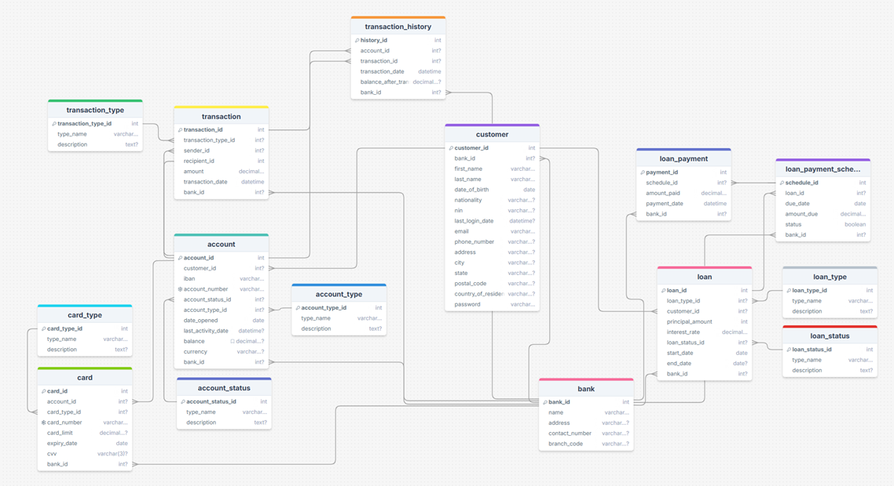

# Etubank

Etubank is a secure banking application designed to help small financial institutions manage customer accounts, process transactions, and handle loans. It provides an efficient platform for users to perform day-to-day banking activities, including:

- **Customer Management**: Manage customer profiles and account details.
- **Transaction Management**: Handle deposits, withdrawals, and transfers.
- **Loan Management**: Apply for and manage loans.